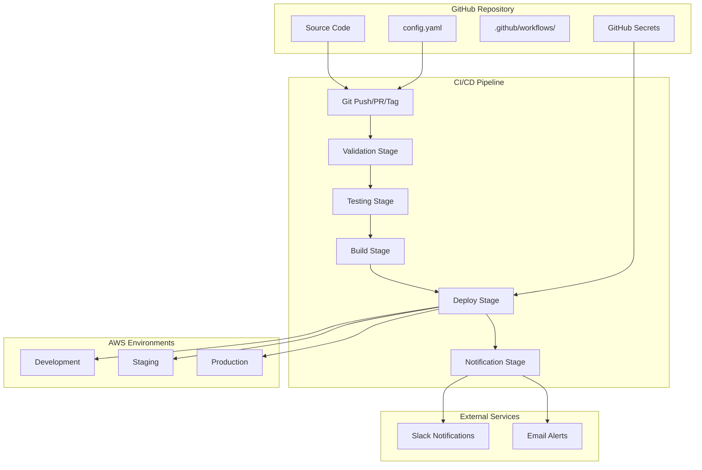
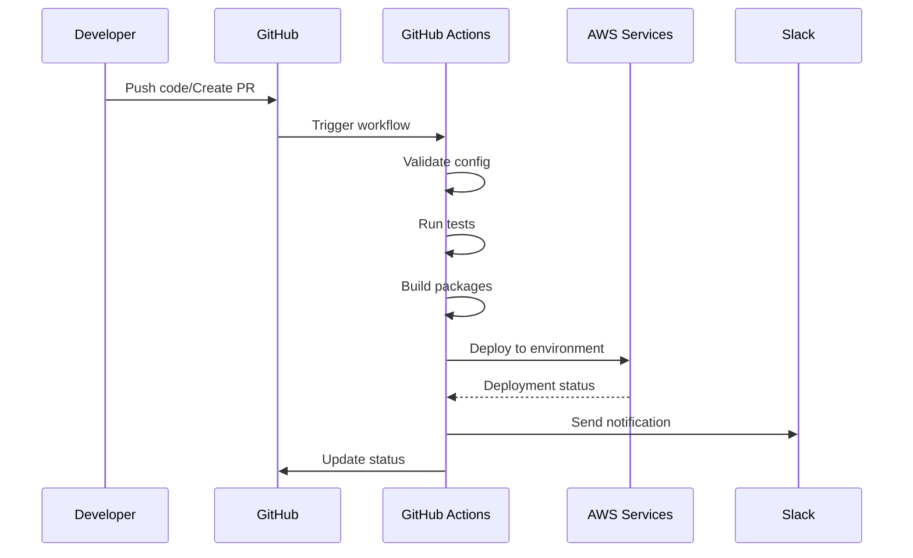
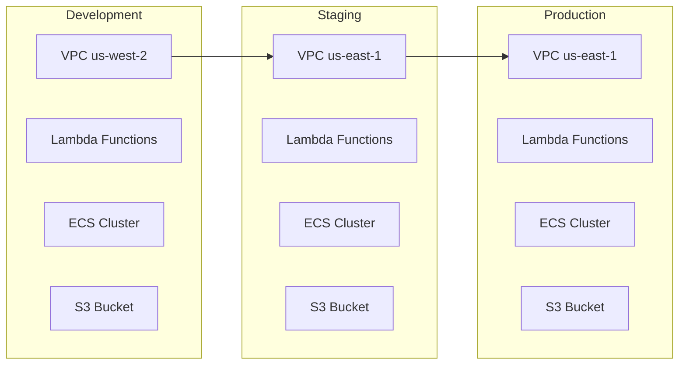

# Design Document

## Overview

This document describes the design of a complete CI/CD pipeline for the Homebrew Bottles Sync System project. The solution includes GitHub Actions workflows, centralized configuration, automated testing, and automatic environment management. The goal is to create a smooth development and deployment experience that enables quick project setup with a single configuration file.

## Architecture

### High-Level Architecture



### Pipeline Flow



## Components and Interfaces

### 1. Configuration Management System

#### Central Configuration File (`config.yaml`)
```yaml
# Global project configuration
project:
  name: "homebrew-bottles-sync"
  description: "Automated Homebrew bottles sync system"
  
# Environment configurations
environments:
  dev:
    aws_region: "us-west-2"
    size_threshold_gb: 5
    schedule_expression: "cron(0 */6 * * ? *)"
    enable_fargate_spot: true
    
  staging:
    aws_region: "us-east-1"
    size_threshold_gb: 15
    schedule_expression: "cron(0 3 ? * SAT *)"
    enable_fargate_spot: true
    
  prod:
    aws_region: "us-east-1"
    size_threshold_gb: 20
    schedule_expression: "cron(0 3 ? * SUN *)"
    enable_fargate_spot: false

# Resource configurations
resources:
  lambda:
    orchestrator_memory: 512
    sync_memory: 3008
    timeout: 900
    
  ecs:
    task_cpu: 2048
    task_memory: 8192
    ephemeral_storage: 100

# Notification settings
notifications:
  slack:
    enabled: true
    channel: "#platform-updates"
  email:
    enabled: true
    addresses: ["devops@company.com"]
```

#### Configuration Processor (`scripts/process-config.py`)
```python
class ConfigProcessor:
    def __init__(self, config_path: str):
        self.config = self.load_config(config_path)
    
    def generate_tfvars(self, environment: str) -> str:
        """Generate terraform.tfvars for specific environment"""
        
    def validate_config(self) -> List[str]:
        """Validate configuration and return errors"""
        
    def get_environment_config(self, env: str) -> Dict:
        """Get configuration for specific environment"""
```

### 2. GitHub Actions Workflows

#### Main CI/CD Workflow (`.github/workflows/cicd.yml`)
```yaml
name: CI/CD Pipeline

on:
  push:
    branches: [main, develop]
  pull_request:
    branches: [main]
  release:
    types: [published]

jobs:
  validate:
    runs-on: ubuntu-latest
    steps:
      - name: Validate configuration
      - name: Terraform validate
      - name: Security scan
      
  test:
    runs-on: ubuntu-latest
    needs: validate
    steps:
      - name: Unit tests
      - name: Integration tests
      - name: Code quality checks
      
  build:
    runs-on: ubuntu-latest
    needs: test
    steps:
      - name: Build Lambda packages
      - name: Build Docker images
      - name: Upload artifacts
      
  deploy:
    runs-on: ubuntu-latest
    needs: build
    strategy:
      matrix:
        environment: [dev, staging, prod]
    steps:
      - name: Configure AWS credentials
      - name: Generate terraform.tfvars
      - name: Deploy infrastructure
      - name: Run smoke tests
```

#### Testing Workflow (`.github/workflows/test.yml`)
```yaml
name: Comprehensive Testing

on:
  workflow_call:
    inputs:
      environment:
        required: true
        type: string

jobs:
  unit-tests:
    runs-on: ubuntu-latest
    steps:
      - name: Python unit tests
      - name: Coverage report
      
  integration-tests:
    runs-on: ubuntu-latest
    steps:
      - name: AWS integration tests
      - name: End-to-end tests
      
  security-tests:
    runs-on: ubuntu-latest
    steps:
      - name: Terraform security scan
      - name: Dependency vulnerability scan
      - name: Secrets detection
```

### 3. Automated Testing Framework

#### Test Structure
```
tests/
├── unit/
│   ├── test_lambda_functions.py
│   ├── test_shared_modules.py
│   └── test_config_processor.py
├── integration/
│   ├── test_aws_services.py
│   ├── test_terraform_modules.py
│   └── test_end_to_end.py
├── security/
│   ├── test_iam_policies.py
│   └── test_secrets_management.py
└── fixtures/
    ├── mock_aws_responses.json
    └── test_configurations.yaml
```

#### Test Implementation
```python
# tests/unit/test_lambda_functions.py
class TestLambdaFunctions:
    def test_orchestrator_handler(self):
        """Test orchestrator Lambda function"""
        
    def test_sync_worker_handler(self):
        """Test sync worker Lambda function"""
        
    def test_error_handling(self):
        """Test error handling scenarios"""

# tests/integration/test_aws_services.py
class TestAWSIntegration:
    def test_s3_operations(self):
        """Test S3 bucket operations"""
        
    def test_lambda_invocation(self):
        """Test Lambda function invocation"""
        
    def test_ecs_task_execution(self):
        """Test ECS task execution"""
```

### 4. Environment Management System

#### Environment Controller (`scripts/environment-manager.py`)
```python
class EnvironmentManager:
    def __init__(self, config: Dict):
        self.config = config
        
    def deploy_environment(self, env_name: str) -> bool:
        """Deploy specific environment"""
        
    def destroy_environment(self, env_name: str) -> bool:
        """Destroy specific environment"""
        
    def get_environment_status(self, env_name: str) -> Dict:
        """Get current environment status"""
        
    def validate_environment(self, env_name: str) -> List[str]:
        """Validate environment configuration"""
```

#### Deployment Strategy
- **Development**: Automatic on push to `develop` branch
- **Staging**: Automatic on push to `main` branch
- **Production**: Manual with approval on release tag creation

### 5. Secrets Management

#### GitHub Secrets Structure
```
AWS_ROLE_ARN_DEV: arn:aws:iam::ACCOUNT:role/github-actions-dev
AWS_ROLE_ARN_STAGING: arn:aws:iam::ACCOUNT:role/github-actions-staging
AWS_ROLE_ARN_PROD: arn:aws:iam::ACCOUNT:role/github-actions-prod
SLACK_WEBHOOK_URL: https://hooks.slack.com/services/...
NOTIFICATION_EMAIL: devops@company.com
```

#### OIDC Configuration
```yaml
# AWS OIDC Identity Provider setup
- name: Configure AWS credentials
  uses: aws-actions/configure-aws-credentials@v4
  with:
    role-to-assume: ${{ secrets.AWS_ROLE_ARN }}
    role-session-name: GitHubActions
    aws-region: ${{ matrix.aws_region }}
```

### 6. Monitoring and Alerting

#### Notification System (`scripts/notification-manager.py`)
```python
class NotificationManager:
    def __init__(self, config: Dict):
        self.slack_webhook = config.get('slack_webhook')
        self.email_addresses = config.get('email_addresses', [])
        
    def send_deployment_success(self, env: str, details: Dict):
        """Send successful deployment notification"""
        
    def send_deployment_failure(self, env: str, error: str):
        """Send failed deployment notification"""
        
    def send_test_results(self, results: Dict):
        """Send test results notification"""
```

#### Slack Message Templates
```python
DEPLOYMENT_SUCCESS_TEMPLATE = {
    "text": "🚀 Deployment Successful",
    "blocks": [
        {
            "type": "section",
            "text": {
                "type": "mrkdwn",
                "text": f"*Environment:* {environment}\n*Duration:* {duration}\n*Commit:* {commit_sha}"
            }
        }
    ]
}
```

## Data Models

### Configuration Models
```python
@dataclass
class EnvironmentConfig:
    name: str
    aws_region: str
    size_threshold_gb: int
    schedule_expression: str
    enable_fargate_spot: bool
    resource_config: ResourceConfig

@dataclass
class ResourceConfig:
    lambda_config: LambdaConfig
    ecs_config: ECSConfig
    
@dataclass
class PipelineConfig:
    environments: List[EnvironmentConfig]
    notifications: NotificationConfig
    testing: TestingConfig
```

### Deployment Models
```python
@dataclass
class DeploymentResult:
    environment: str
    status: str  # success, failed, in_progress
    duration: int
    commit_sha: str
    terraform_outputs: Dict
    errors: List[str] = field(default_factory=list)

@dataclass
class TestResult:
    test_type: str  # unit, integration, security
    status: str
    duration: int
    coverage: float
    failed_tests: List[str] = field(default_factory=list)
```

## Error Handling

### Error Categories
1. **Configuration Errors**: Errors in configuration file
2. **Build Errors**: Errors in package building
3. **Deployment Errors**: Errors in AWS deployment
4. **Test Failures**: Test failures
5. **Infrastructure Errors**: AWS infrastructure issues

### Error Handling Strategy
```python
class PipelineErrorHandler:
    def handle_configuration_error(self, error: ConfigError):
        """Handle configuration validation errors"""
        self.notify_error("Configuration Error", error.message)
        self.fail_pipeline_with_guidance(error.fix_suggestions)
        
    def handle_deployment_error(self, error: DeploymentError):
        """Handle deployment failures"""
        self.rollback_if_possible(error.environment)
        self.notify_error("Deployment Failed", error.details)
        
    def handle_test_failure(self, results: TestResult):
        """Handle test failures"""
        self.generate_test_report(results)
        self.block_deployment_if_critical(results)
```

### Rollback Strategy
```python
class RollbackManager:
    def can_rollback(self, environment: str) -> bool:
        """Check if rollback is possible"""
        
    def rollback_deployment(self, environment: str) -> bool:
        """Rollback to previous stable version"""
        
    def create_rollback_plan(self, environment: str) -> RollbackPlan:
        """Create detailed rollback plan"""
```

## Testing Strategy

### Test Pyramid
1. **Unit Tests (70%)**
   - Lambda function logic
   - Configuration processing
   - Utility functions
   - Data models

2. **Integration Tests (20%)**
   - AWS service interactions
   - Terraform module testing
   - End-to-end workflows

3. **Security Tests (10%)**
   - IAM policy validation
   - Secrets management
   - Network security

### Test Automation
```python
class TestOrchestrator:
    def run_unit_tests(self) -> TestResult:
        """Run all unit tests with coverage"""
        
    def run_integration_tests(self, environment: str) -> TestResult:
        """Run integration tests against AWS"""
        
    def run_security_tests(self) -> TestResult:
        """Run security and compliance tests"""
        
    def generate_test_report(self, results: List[TestResult]) -> str:
        """Generate comprehensive test report"""
```

### Mock Strategy
```python
# tests/mocks/aws_mocks.py
class MockAWSServices:
    def mock_s3_operations(self):
        """Mock S3 bucket operations"""
        
    def mock_lambda_invocations(self):
        """Mock Lambda function calls"""
        
    def mock_ecs_tasks(self):
        """Mock ECS task execution"""
```

## Performance Considerations

### Pipeline Optimization
1. **Parallel Execution**: Running tests in parallel
2. **Caching**: Storing dependencies and build artifacts
3. **Conditional Deployment**: Deploy only when there are changes
4. **Resource Optimization**: Using appropriate resources for each environment

### Cost Optimization
```python
class CostOptimizer:
    def optimize_environment_resources(self, env: str):
        """Optimize resources based on environment type"""
        
    def schedule_environment_shutdown(self, env: str):
        """Schedule automatic shutdown for dev environments"""
        
    def estimate_deployment_cost(self, env: str) -> float:
        """Estimate deployment cost"""
```

## Security Design

### Access Control
1. **OIDC Federation**: No AWS credentials stored in GitHub
2. **Least Privilege**: Each role receives only required permissions
3. **Environment Isolation**: Complete separation between environments
4. **Secrets Rotation**: Automatic rotation of secrets

### Security Scanning
```python
class SecurityScanner:
    def scan_terraform_code(self) -> List[SecurityIssue]:
        """Scan Terraform code for security issues"""
        
    def scan_dependencies(self) -> List[Vulnerability]:
        """Scan Python dependencies for vulnerabilities"""
        
    def scan_secrets(self) -> List[SecretLeak]:
        """Scan code for accidentally committed secrets"""
```

## Deployment Architecture

### Multi-Environment Strategy


### Infrastructure as Code
```hcl
# terraform/environments/dev/main.tf
module "homebrew_sync" {
  source = "../../"
  
  # Environment-specific overrides
  environment = "dev"
  aws_region = var.aws_region
  
  # Cost-optimized settings
  ecs_task_cpu = 1024
  ecs_task_memory = 4096
  enable_fargate_spot = true
  
  # Development-specific settings
  schedule_expression = "cron(0 */6 * * ? *)"
  size_threshold_gb = 5
}
```

## Integration Points

### GitHub Integration
- **Webhooks**: Automatic trigger on push/PR
- **Status Checks**: Status updates in GitHub interface
- **Artifacts**: Storing build artifacts
- **Releases**: Automatic release management

### AWS Integration
- **CloudFormation/Terraform**: Infrastructure management
- **CloudWatch**: Monitoring and logging
- **SNS/SES**: Notifications
- **Secrets Manager**: Secrets management

### External Services
- **Slack**: Real-time notifications
- **Email**: Critical alerts
- **Monitoring Tools**: Integration with external monitoring tools