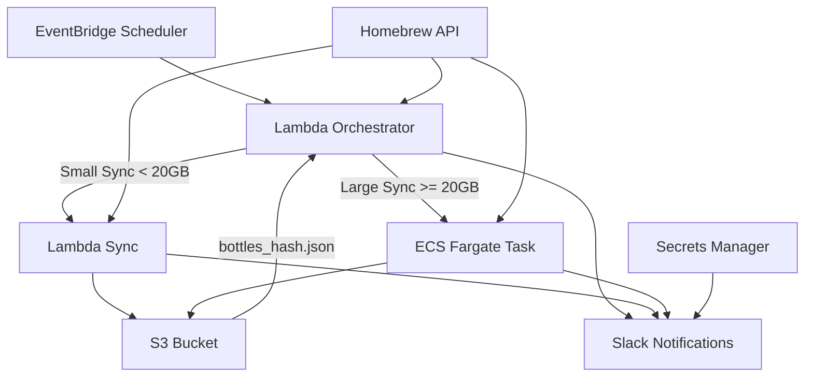

# Design Document

## Overview

The Homebrew Bottles Sync System is a cloud-native solution that automatically mirrors Homebrew bottles for macOS systems. The architecture uses a hybrid approach combining AWS Lambda for lightweight orchestration and ECS for heavy-duty downloading tasks. The system is designed to handle large-scale bottle synchronization (potentially 100+ GB) while maintaining cost efficiency and reliability.

## Architecture

### High-Level Architecture



### Component Interaction Flow

1. **EventBridge** triggers the Lambda Orchestrator weekly
2. **Lambda Orchestrator** fetches formula data and estimates download size
3. Based on size threshold, routes to either Lambda Sync or ECS Task
4. **Sync components** download bottles, check against hash file, upload to S3
5. **Slack notifications** provide status updates throughout the process

## Components and Interfaces

### 1. Lambda Orchestrator

**Purpose:** Central coordination and decision-making component

**Responsibilities:**
- Fetch Homebrew formula list from API
- Load and validate existing bottles_hash.json
- Estimate total download size
- Route to appropriate sync mechanism (Lambda vs ECS)
- Send initial Slack notifications
- Handle error scenarios and cleanup

**Interface:**
```python
class OrchestrationService:
    def handle_scheduled_event(self, event: dict) -> dict
    def fetch_formula_list(self) -> List[Formula]
    def load_existing_hash_file(self) -> Dict[str, str]
    def estimate_download_size(self, formulas: List[Formula]) -> int
    def trigger_lambda_sync(self, formulas: List[Formula]) -> None
    def trigger_ecs_sync(self, formulas: List[Formula]) -> None
```

### 2. Lambda Sync Worker

**Purpose:** Handle small to medium-sized bottle downloads (< 20GB)

**Responsibilities:**
- Download bottles for specified formulas and macOS versions
- Validate SHA checksums against hash file
- Upload bottles to S3 with date-based folder structure
- Update bottles_hash.json
- Send completion notifications

**Constraints:**
- 15-minute execution limit
- 10GB temporary storage limit
- Memory: 3008MB maximum

### 3. ECS Sync Worker

**Purpose:** Handle large-scale bottle downloads (>= 20GB)

**Responsibilities:**
- Same as Lambda Sync Worker but with extended capabilities
- Support for long-running downloads (hours)
- Large temporary storage via EFS or ephemeral storage
- Batch processing with progress tracking
- Graceful handling of network interruptions

**Configuration:**
- CPU: 2-4 vCPUs
- Memory: 8-16GB
- Storage: EFS mount or 200GB ephemeral
- Network: Enhanced networking for faster downloads

### 4. S3 Storage Service

**Purpose:** Persistent storage for bottles and metadata

**Structure:**
```
s3://homebrew-bottle-mirror/
├── bottles_hash.json                    # Global hash tracking
├── 2025-07-21/                         # Date-based folders
│   ├── curl-8.0.0.arm64_sonoma.bottle.tar.gz
│   ├── curl-8.0.0.arm64_ventura.bottle.tar.gz
│   └── curl-8.0.0.monterey.bottle.tar.gz
└── 2025-07-28/
    └── ...
```

**Features:**
- Versioning enabled for hash file protection
- Lifecycle policies for cost optimization
- Cross-region replication (optional)

### 5. Notification Service

**Purpose:** Status reporting via Slack webhooks

**Message Types:**
- Sync initiation: "🚀 Homebrew sync started for 2025-07-21"
- Progress updates (ECS only): "⏳ Downloaded 45/150 bottles (2.3GB)"
- Success: "✅ Homebrew sync complete. 143 new bottles downloaded (512 MB)"
- Failure: "❌ Homebrew sync failed: Timeout on curl formula"

## Data Models

### Formula Model
```python
@dataclass
class Formula:
    name: str
    version: str
    bottles: Dict[str, BottleInfo]  # platform -> bottle info
    
@dataclass
class BottleInfo:
    url: str
    sha256: str
    size: int
```

### Hash File Model
```python
@dataclass
class HashEntry:
    formula_name: str
    version: str
    platform: str
    sha256: str
    download_date: str
    file_size: int

# bottles_hash.json structure
{
    "last_updated": "2025-07-21T03:00:00Z",
    "bottles": {
        "curl-8.0.0-arm64_sonoma": {
            "sha256": "abc123...",
            "download_date": "2025-07-21",
            "file_size": 1048576
        }
    }
}
```

### Sync Configuration Model
```python
@dataclass
class SyncConfig:
    target_platforms: List[str] = ["arm64_sonoma", "arm64_ventura", "monterey"]
    size_threshold_gb: int = 20
    max_concurrent_downloads: int = 10
    retry_attempts: int = 3
    slack_webhook_url: str
```

## Error Handling

### Error Categories and Responses

1. **Network Errors**
   - Retry with exponential backoff
   - Switch to alternative download mirrors if available
   - Fail gracefully after max retries

2. **Storage Errors**
   - Validate S3 permissions before starting
   - Implement atomic updates for hash file
   - Rollback partial uploads on failure

3. **Resource Exhaustion**
   - Monitor Lambda memory/time limits
   - Implement ECS task auto-scaling
   - Queue management for large formula sets

4. **Data Integrity Errors**
   - Validate SHA checksums for all downloads
   - Quarantine corrupted bottles
   - Alert on hash file corruption

### Error Recovery Strategies

- **Partial Sync Recovery:** Resume from last successful bottle
- **Hash File Corruption:** Rebuild from S3 object metadata
- **ECS Task Failure:** Automatic retry with CloudWatch monitoring
- **Lambda Timeout:** Graceful handoff to ECS for completion

## Testing Strategy

### Unit Testing
- Formula parsing and validation
- Hash file operations (load, update, validate)
- S3 upload/download operations
- Slack notification formatting

### Integration Testing
- End-to-end sync workflow (Lambda path)
- End-to-end sync workflow (ECS path)
- Error handling and recovery scenarios
- Cross-service communication (Lambda -> ECS)

### Performance Testing
- Large formula set processing (1000+ formulas)
- Concurrent download limits
- S3 upload throughput optimization
- Memory usage profiling

### Security Testing
- IAM permission validation
- Secrets Manager integration
- S3 bucket policy enforcement
- Network security group configuration

## Infrastructure Components

### Terraform Module Structure

1. **Network Module** (`modules/network/`)
   - VPC configuration (if ECS requires private networking)
   - Security groups for ECS tasks
   - NAT Gateway for outbound internet access

2. **S3 Module** (`modules/s3/`)
   - Bucket creation with versioning
   - Lifecycle policies
   - IAM policies for bucket access

3. **Lambda Module** (`modules/lambda/`)
   - Orchestrator and Sync Lambda functions
   - IAM roles and policies
   - Environment variable configuration

4. **ECS Module** (`modules/ecs/`)
   - ECS cluster (Fargate)
   - Task definitions
   - IAM roles for task execution
   - EFS file system (if needed)

5. **EventBridge Module** (`modules/eventbridge/`)
   - Scheduled rules (weekly cron)
   - Lambda function targets

6. **Notifications Module** (`modules/notifications/`)
   - Secrets Manager for webhook URLs
   - SNS topics (optional)

### Security Considerations

- **Least Privilege IAM:** Each component has minimal required permissions
- **Secrets Management:** Slack webhooks stored in AWS Secrets Manager
- **Network Security:** ECS tasks in private subnets with NAT Gateway
- **Data Encryption:** S3 server-side encryption enabled
- **Access Logging:** CloudTrail and S3 access logs enabled

### Monitoring and Observability

- **CloudWatch Metrics:** Custom metrics for sync progress and errors
- **CloudWatch Logs:** Structured logging for all components
- **X-Ray Tracing:** Distributed tracing for Lambda functions
- **CloudWatch Alarms:** Automated alerting for failures
- **Cost Monitoring:** Budget alerts for unexpected usage spikes