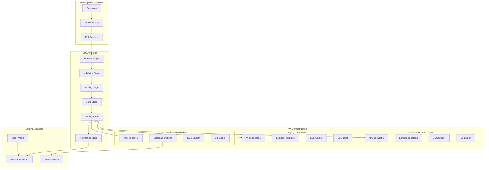
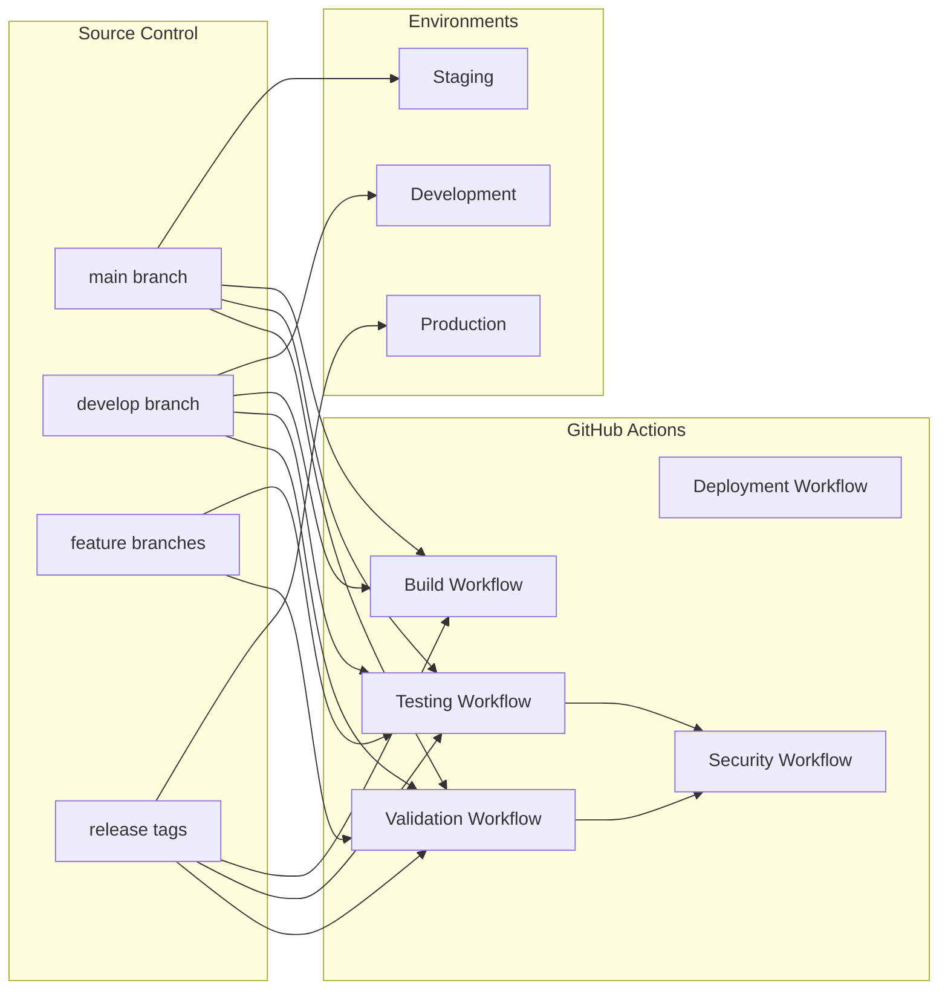
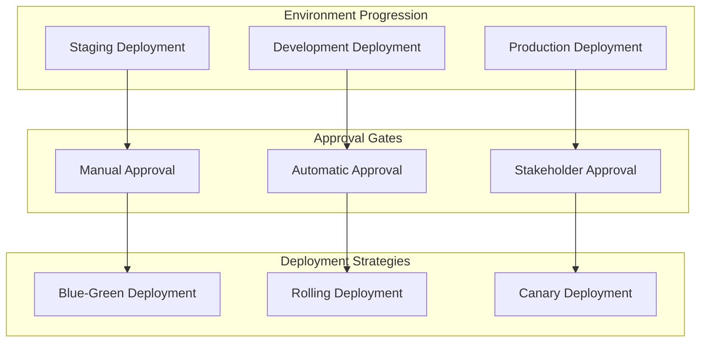
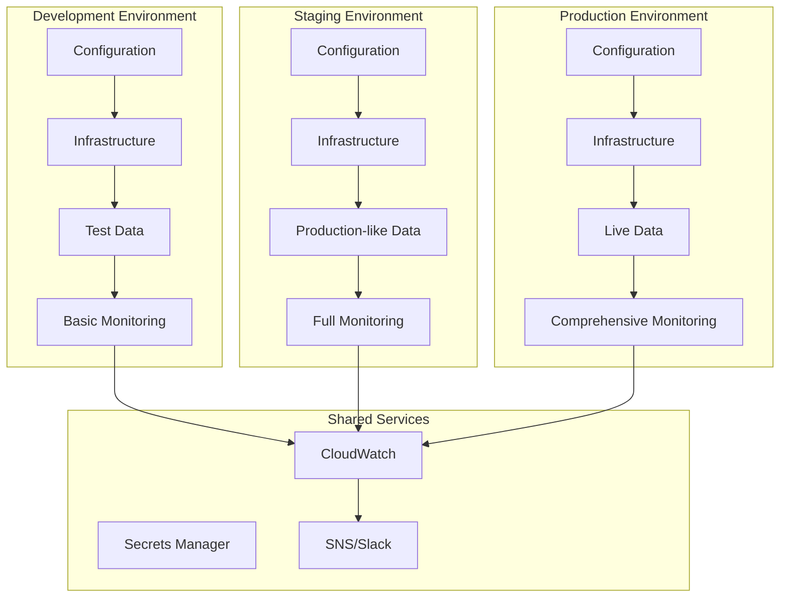
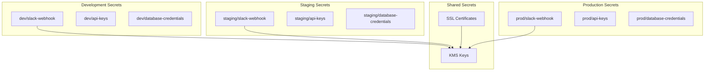
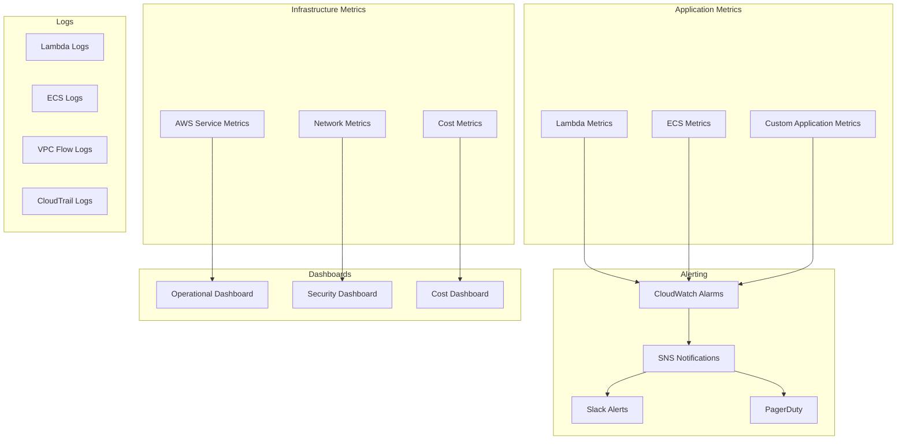
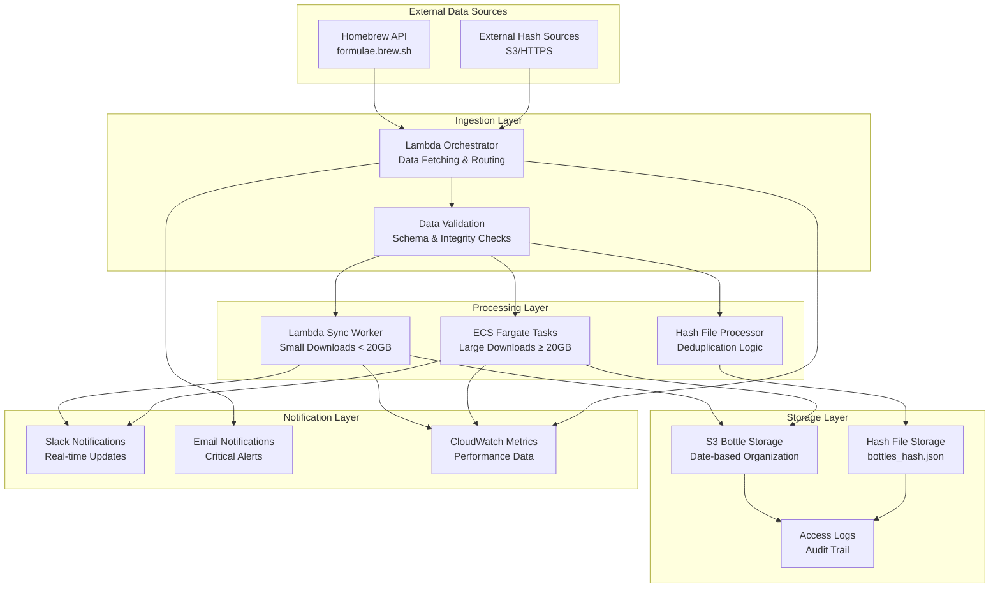
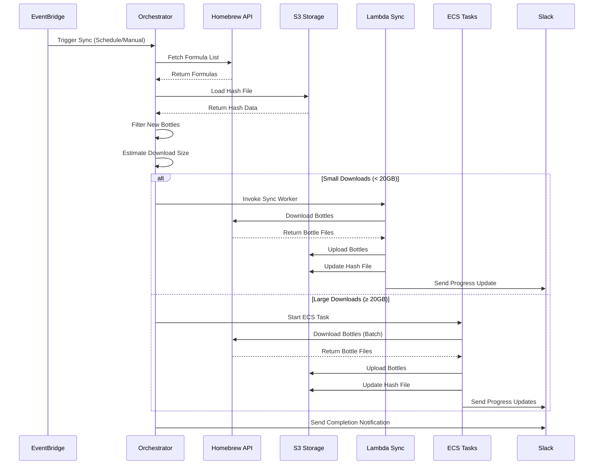
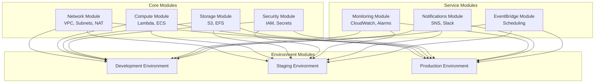

# Homebrew Bottles Sync System - Architecture and Workflows

This document provides comprehensive documentation of the system architecture, CI/CD pipeline workflows, deployment strategies, and security controls for the Homebrew Bottles Sync System.

## Table of Contents

1. [System Architecture Overview](#system-architecture-overview)
2. [CI/CD Pipeline Architecture](#cicd-pipeline-architecture)
3. [Deployment Workflows](#deployment-workflows)
4. [Environment Management](#environment-management)
5. [Security Architecture](#security-architecture)
6. [Monitoring and Observability](#monitoring-and-observability)
7. [Data Flow and Processing](#data-flow-and-processing)
8. [Infrastructure Components](#infrastructure-components)

## System Architecture Overview

### High-Level Architecture

The Homebrew Bottles Sync System follows a microservices architecture deployed on AWS, with a comprehensive CI/CD pipeline for automated deployment and management.



### Core Components

#### 1. Configuration Management System
- **Central Configuration**: Single `config.yaml` file for all environments
- **Environment-Specific Generation**: Automatic `terraform.tfvars` generation
- **Validation Engine**: Comprehensive configuration validation
- **Template Processing**: Dynamic configuration based on environment

#### 2. CI/CD Pipeline System
- **GitHub Actions Workflows**: Automated testing and deployment
- **Multi-Environment Support**: Dev, staging, and production pipelines
- **Security Scanning**: Integrated security and compliance checks
- **Artifact Management**: Build and deployment artifact handling

#### 3. Infrastructure as Code
- **Terraform Modules**: Modular infrastructure components
- **Environment Isolation**: Complete separation between environments
- **State Management**: Centralized Terraform state with locking
- **Resource Optimization**: Environment-specific resource allocation

#### 4. Application Runtime
- **Lambda Functions**: Orchestration and lightweight processing
- **ECS Fargate**: Heavy processing and large downloads
- **S3 Storage**: Bottle storage and state management
- **EventBridge**: Scheduling and event-driven processing

## CI/CD Pipeline Architecture

### Pipeline Overview



### Workflow Definitions

#### 1. Validation Workflow (`.github/workflows/validate.yml`)

**Triggers:**
- Pull requests to `main` or `develop`
- Push to any branch

**Steps:**
1. **Configuration Validation**
   - YAML syntax validation
   - Schema compliance checking
   - Environment-specific validation
   - Cross-reference validation

2. **Terraform Validation**
   - Syntax validation (`terraform validate`)
   - Format checking (`terraform fmt -check`)
   - Plan generation and validation
   - Module dependency validation

3. **Code Quality Checks**
   - Python linting (flake8, black, isort)
   - Security scanning (bandit)
   - Dependency vulnerability scanning
   - Documentation completeness

```yaml
name: Validation Pipeline

on:
  push:
    branches: [ main, develop ]
  pull_request:
    branches: [ main, develop ]

jobs:
  validate-config:
    runs-on: ubuntu-latest
    steps:
      - uses: actions/checkout@v4
      - name: Validate Configuration
        run: python3 scripts/config_processor.py --validate
      
  validate-terraform:
    runs-on: ubuntu-latest
    steps:
      - uses: actions/checkout@v4
      - uses: hashicorp/setup-terraform@v3
      - name: Terraform Validate
        run: |
          cd terraform
          terraform init -backend=false
          terraform validate
          terraform fmt -check
          
  validate-code:
    runs-on: ubuntu-latest
    steps:
      - uses: actions/checkout@v4
      - uses: actions/setup-python@v4
        with:
          python-version: '3.11'
      - name: Install Dependencies
        run: pip install -r requirements.txt
      - name: Lint Code
        run: |
          flake8 . --count --select=E9,F63,F7,F82 --show-source --statistics
          black --check .
          isort --check-only .
      - name: Security Scan
        run: bandit -r . -f json -o bandit-report.json
```

#### 2. Testing Workflow (`.github/workflows/test.yml`)

**Triggers:**
- Called by other workflows
- Manual dispatch

**Test Suites:**
1. **Unit Tests**
   - Lambda function logic
   - Configuration processing
   - Utility functions
   - Data models

2. **Integration Tests**
   - AWS service interactions (mocked)
   - Terraform module testing
   - End-to-end workflow simulation

3. **Security Tests**
   - IAM policy validation
   - Secrets management testing
   - Network security validation

```yaml
name: Testing Pipeline

on:
  workflow_call:
    inputs:
      environment:
        required: true
        type: string

jobs:
  unit-tests:
    runs-on: ubuntu-latest
    steps:
      - uses: actions/checkout@v4
      - uses: actions/setup-python@v4
        with:
          python-version: '3.11'
      - name: Install Dependencies
        run: pip install -r requirements.txt
      - name: Run Unit Tests
        run: |
          python -m pytest tests/unit/ -v --cov=. --cov-report=xml
      - name: Upload Coverage
        uses: codecov/codecov-action@v3
        
  integration-tests:
    runs-on: ubuntu-latest
    steps:
      - uses: actions/checkout@v4
      - name: Run Integration Tests
        run: |
          python -m pytest tests/integration/ -v --tb=short
          
  security-tests:
    runs-on: ubuntu-latest
    steps:
      - uses: actions/checkout@v4
      - name: Run Security Tests
        run: |
          python -m pytest tests/security/ -v
          ./scripts/validate-iam-policies.sh
```

#### 3. Build Workflow (`.github/workflows/build.yml`)

**Responsibilities:**
1. **Lambda Package Building**
   - Dependency installation
   - Package creation
   - Artifact storage

2. **Container Image Building**
   - Docker image building
   - ECR repository management
   - Image scanning and tagging

3. **Terraform Module Packaging**
   - Module validation
   - Documentation generation
   - Version tagging

```yaml
name: Build Pipeline

on:
  workflow_call:
    inputs:
      environment:
        required: true
        type: string

jobs:
  build-lambda:
    runs-on: ubuntu-latest
    steps:
      - uses: actions/checkout@v4
      - name: Build Lambda Packages
        run: ./scripts/build-lambda-packages.sh
      - name: Upload Artifacts
        uses: actions/upload-artifact@v3
        with:
          name: lambda-packages
          path: build/
          
  build-container:
    runs-on: ubuntu-latest
    steps:
      - uses: actions/checkout@v4
      - name: Configure AWS Credentials
        uses: aws-actions/configure-aws-credentials@v4
        with:
          role-to-assume: ${{ secrets.AWS_ROLE_ARN }}
          aws-region: us-east-1
      - name: Build and Push Container
        run: |
          aws ecr get-login-password | docker login --username AWS --password-stdin $ECR_REGISTRY
          docker build -t homebrew-bottles-sync:$GITHUB_SHA ./ecs/sync/
          docker tag homebrew-bottles-sync:$GITHUB_SHA $ECR_REGISTRY/homebrew-bottles-sync:$GITHUB_SHA
          docker push $ECR_REGISTRY/homebrew-bottles-sync:$GITHUB_SHA
```

#### 4. Deployment Workflow (`.github/workflows/deploy.yml`)

**Environment-Specific Deployment:**
- **Development**: Automatic on push to `develop`
- **Staging**: Automatic on push to `main`
- **Production**: Manual approval on release tags

```yaml
name: Deployment Pipeline

on:
  push:
    branches: [ main, develop ]
  release:
    types: [ published ]

jobs:
  deploy-dev:
    if: github.ref == 'refs/heads/develop'
    runs-on: ubuntu-latest
    environment: development
    steps:
      - uses: actions/checkout@v4
      - name: Deploy to Development
        run: ./scripts/deploy-dev.sh --auto-approve
        
  deploy-staging:
    if: github.ref == 'refs/heads/main'
    runs-on: ubuntu-latest
    environment: staging
    steps:
      - uses: actions/checkout@v4
      - name: Deploy to Staging
        run: ./scripts/deploy-staging.sh --auto-approve
        
  deploy-prod:
    if: github.event_name == 'release'
    runs-on: ubuntu-latest
    environment: production
    steps:
      - uses: actions/checkout@v4
      - name: Deploy to Production
        run: ./scripts/deploy-prod.sh
```

## Deployment Workflows

### Deployment Strategy Overview



### Environment-Specific Deployment Workflows

#### Development Environment Workflow

**Characteristics:**
- **Trigger**: Push to `develop` branch
- **Approval**: Automatic
- **Strategy**: Rolling deployment
- **Rollback**: Automatic on failure
- **Notifications**: Slack only

**Workflow Steps:**
1. **Pre-deployment Validation**
   ```bash
   # Configuration validation
   python3 scripts/config_processor.py --validate --environment dev
   
   # Infrastructure validation
   cd terraform/environments/dev
   terraform plan -var-file=dev.tfvars
   ```

2. **Deployment Execution**
   ```bash
   # Deploy infrastructure
   ./scripts/deploy-environment.sh --environment dev --auto-approve
   
   # Verify deployment
   ./scripts/deployment-health-check.py --environment dev
   ```

3. **Post-deployment Testing**
   ```bash
   # Run smoke tests
   python3 -m pytest tests/smoke/ --environment dev
   
   # Verify functionality
   aws lambda invoke --function-name homebrew-sync-dev-orchestrator test-response.json
   ```

#### Staging Environment Workflow

**Characteristics:**
- **Trigger**: Push to `main` branch
- **Approval**: Manual (team lead)
- **Strategy**: Blue-green deployment
- **Rollback**: Manual with approval
- **Notifications**: Slack + Email

**Workflow Steps:**
1. **Pre-deployment Preparation**
   ```bash
   # Create deployment snapshot
   ./scripts/create-deployment-snapshot.sh --environment staging
   
   # Validate against production-like data
   ./scripts/validate-staging-readiness.sh
   ```

2. **Blue-Green Deployment**
   ```bash
   # Deploy to green environment
   ./scripts/deploy-blue-green.sh --environment staging --target green
   
   # Run comprehensive tests
   ./scripts/run-integration-tests.sh --environment staging --target green
   
   # Switch traffic to green
   ./scripts/switch-traffic.sh --environment staging --from blue --to green
   ```

3. **Validation and Monitoring**
   ```bash
   # Monitor for 30 minutes
   ./scripts/monitor-deployment.sh --environment staging --duration 30m
   
   # Validate metrics
   ./scripts/validate-deployment-metrics.sh --environment staging
   ```

#### Production Environment Workflow

**Characteristics:**
- **Trigger**: Release tag creation
- **Approval**: Multi-stakeholder approval
- **Strategy**: Canary deployment
- **Rollback**: Immediate on any issues
- **Notifications**: All channels + PagerDuty

**Workflow Steps:**
1. **Pre-production Validation**
   ```bash
   # Final security scan
   ./scripts/security-scan.sh --comprehensive
   
   # Performance baseline
   ./scripts/capture-performance-baseline.sh --environment prod
   
   # Stakeholder approval
   ./scripts/request-production-approval.sh --release-tag $RELEASE_TAG
   ```

2. **Canary Deployment**
   ```bash
   # Deploy canary (5% traffic)
   ./scripts/deploy-canary.sh --environment prod --traffic-percentage 5
   
   # Monitor canary for 1 hour
   ./scripts/monitor-canary.sh --duration 1h --auto-rollback-on-error
   
   # Gradual traffic increase (5% -> 25% -> 50% -> 100%)
   ./scripts/increase-canary-traffic.sh --environment prod --schedule gradual
   ```

3. **Full Deployment Validation**
   ```bash
   # Complete deployment
   ./scripts/complete-canary-deployment.sh --environment prod
   
   # Run production validation suite
   ./scripts/validate-production-deployment.sh
   
   # Update monitoring baselines
   ./scripts/update-monitoring-baselines.sh --environment prod
   ```

### Rollback Procedures

#### Automatic Rollback Triggers

```yaml
# Rollback conditions
rollback_conditions:
  error_rate_threshold: 5%      # Error rate above 5%
  latency_threshold: 30s        # Response time above 30 seconds
  availability_threshold: 99%   # Availability below 99%
  custom_metrics:
    - metric: "bottles_sync_failure_rate"
      threshold: 10%
    - metric: "s3_upload_errors"
      threshold: 5%
```

#### Manual Rollback Process

```bash
# List rollback candidates
./scripts/rollback-deployment.sh --environment prod --list-candidates

# Perform rollback
./scripts/rollback-deployment.sh --environment prod --target-commit abc123 --reason "High error rate"

# Verify rollback
./scripts/verify-rollback.sh --environment prod --commit abc123
```

## Environment Management

### Environment Architecture



### Environment Isolation Strategy

#### Network Isolation

```hcl
# Development Environment (us-west-2)
module "dev_network" {
  source = "./modules/network"
  
  vpc_cidr = "10.0.0.0/16"
  environment = "dev"
  
  # Cost-optimized settings
  enable_nat_gateway = true
  nat_gateway_count = 1  # Single NAT for cost savings
  
  # Development-specific security groups
  additional_security_groups = [
    {
      name = "dev-debug-access"
      ingress_rules = [
        {
          from_port = 22
          to_port = 22
          protocol = "tcp"
          cidr_blocks = ["10.0.0.0/16"]
        }
      ]
    }
  ]
}

# Production Environment (us-east-1)
module "prod_network" {
  source = "./modules/network"
  
  vpc_cidr = "10.1.0.0/16"
  environment = "prod"
  
  # High availability settings
  enable_nat_gateway = true
  nat_gateway_count = 2  # Multi-AZ NAT for reliability
  
  # Production security groups (restrictive)
  additional_security_groups = [
    {
      name = "prod-restricted-access"
      ingress_rules = []  # No direct access
    }
  ]
}
```

#### Resource Isolation

```yaml
# Environment-specific resource allocation
environments:
  dev:
    # Minimal resources for cost optimization
    lambda_memory: 256
    ecs_cpu: 512
    ecs_memory: 1024
    s3_lifecycle_days: 7
    log_retention_days: 3
    
  staging:
    # Production-like resources
    lambda_memory: 512
    ecs_cpu: 1024
    ecs_memory: 4096
    s3_lifecycle_days: 30
    log_retention_days: 14
    
  prod:
    # Full production resources
    lambda_memory: 1024
    ecs_cpu: 2048
    ecs_memory: 8192
    s3_lifecycle_days: 90
    log_retention_days: 30
```

#### Access Control Isolation

```json
{
  "Version": "2012-10-17",
  "Statement": [
    {
      "Sid": "DevelopmentEnvironmentAccess",
      "Effect": "Allow",
      "Principal": {
        "AWS": "arn:aws:iam::ACCOUNT:role/DeveloperRole"
      },
      "Action": "*",
      "Resource": "*",
      "Condition": {
        "StringEquals": {
          "aws:RequestedRegion": "us-west-2"
        },
        "ForAllValues:StringLike": {
          "aws:ResourceTag/Environment": "dev"
        }
      }
    },
    {
      "Sid": "ProductionEnvironmentAccess",
      "Effect": "Allow",
      "Principal": {
        "AWS": "arn:aws:iam::ACCOUNT:role/ProductionAdminRole"
      },
      "Action": "*",
      "Resource": "*",
      "Condition": {
        "StringEquals": {
          "aws:RequestedRegion": "us-east-1"
        },
        "ForAllValues:StringLike": {
          "aws:ResourceTag/Environment": "prod"
        }
      }
    }
  ]
}
```

## Security Architecture

### Security Framework Overview

```mermaid
graph TB
    subgraph "Identity and Access Management"
        GITHUB_OIDC[GitHub OIDC Provider]
        IAM_ROLES[Environment-Specific IAM Roles]
        LEAST_PRIVILEGE[Least Privilege Policies]
    end
    
    subgraph "Secrets Management"
        SECRETS_MANAGER[AWS Secrets Manager]
        SECRET_ROTATION[Automatic Rotation]
        SECRET_ENCRYPTION[KMS Encryption]
    end
    
    subgraph "Network Security"
        VPC_ISOLATION[VPC Isolation]
        SECURITY_GROUPS[Security Groups]
        NACLS[Network ACLs]
        VPC_ENDPOINTS[VPC Endpoints]
    end
    
    subgraph "Data Security"
        S3_ENCRYPTION[S3 Encryption at Rest]
        TRANSIT_ENCRYPTION[Encryption in Transit]
        DATA_CLASSIFICATION[Data Classification]
    end
    
    subgraph "Monitoring and Compliance"
        CLOUDTRAIL[CloudTrail Logging]
        CONFIG_RULES[AWS Config Rules]
        SECURITY_SCANNING[Security Scanning]
        COMPLIANCE_MONITORING[Compliance Monitoring]
    end
    
    GITHUB_OIDC --> IAM_ROLES
    IAM_ROLES --> LEAST_PRIVILEGE
    
    SECRETS_MANAGER --> SECRET_ROTATION
    SECRET_ROTATION --> SECRET_ENCRYPTION
    
    VPC_ISOLATION --> SECURITY_GROUPS
    SECURITY_GROUPS --> NACLS
    NACLS --> VPC_ENDPOINTS
    
    S3_ENCRYPTION --> TRANSIT_ENCRYPTION
    TRANSIT_ENCRYPTION --> DATA_CLASSIFICATION
    
    CLOUDTRAIL --> CONFIG_RULES
    CONFIG_RULES --> SECURITY_SCANNING
    SECURITY_SCANNING --> COMPLIANCE_MONITORING
```



### GitHub OIDC Integration

#### OIDC Provider Configuration

```hcl
# GitHub OIDC Provider
resource "aws_iam_openid_connect_provider" "github" {
  url = "https://token.actions.githubusercontent.com"
  
  client_id_list = [
    "sts.amazonaws.com"
  ]
  
  thumbprint_list = [
    "6938fd4d98bab03faadb97b34396831e3780aea1"
  ]
  
  tags = {
    Name = "github-actions-oidc"
    Environment = "shared"
  }
}

# Environment-specific roles
resource "aws_iam_role" "github_actions_dev" {
  name = "github-actions-dev-role"
  
  assume_role_policy = jsonencode({
    Version = "2012-10-17"
    Statement = [
      {
        Action = "sts:AssumeRoleWithWebIdentity"
        Effect = "Allow"
        Principal = {
          Federated = aws_iam_openid_connect_provider.github.arn
        }
        Condition = {
          StringEquals = {
            "token.actions.githubusercontent.com:aud" = "sts.amazonaws.com"
          }
          StringLike = {
            "token.actions.githubusercontent.com:sub" = "repo:org/homebrew-bottles-sync:ref:refs/heads/develop"
          }
        }
      }
    ]
  })
}
```

#### Role-Based Access Control

```yaml
# GitHub Actions environment configuration
environments:
  development:
    aws_role_arn: "arn:aws:iam::ACCOUNT:role/github-actions-dev-role"
    allowed_branches: ["develop", "feature/*"]
    auto_approve: true
    
  staging:
    aws_role_arn: "arn:aws:iam::ACCOUNT:role/github-actions-staging-role"
    allowed_branches: ["main"]
    auto_approve: false
    required_reviewers: ["team-lead"]
    
  production:
    aws_role_arn: "arn:aws:iam::ACCOUNT:role/github-actions-prod-role"
    allowed_branches: ["main"]
    auto_approve: false
    required_reviewers: ["team-lead", "security-team"]
    approval_timeout: "24h"
```

### Secrets Management Architecture

#### Secrets Organization



#### Secret Rotation Strategy

```python
# Automatic secret rotation configuration
secret_rotation_config = {
    "slack-webhook": {
        "rotation_interval": "90d",
        "rotation_lambda": "rotate-slack-webhook",
        "notification_channels": ["security-team"]
    },
    "api-keys": {
        "rotation_interval": "30d",
        "rotation_lambda": "rotate-api-keys",
        "notification_channels": ["dev-team", "security-team"]
    },
    "database-credentials": {
        "rotation_interval": "60d",
        "rotation_lambda": "rotate-db-credentials",
        "notification_channels": ["dba-team", "security-team"]
    }
}
```

### Network Security Controls

#### Security Group Configuration

```hcl
# ECS Task Security Group
resource "aws_security_group" "ecs_tasks" {
  name_prefix = "homebrew-sync-ecs-"
  vpc_id      = module.network.vpc_id
  
  # Outbound rules (restrictive)
  egress {
    description = "HTTPS to Homebrew API"
    from_port   = 443
    to_port     = 443
    protocol    = "tcp"
    cidr_blocks = ["0.0.0.0/0"]
  }
  
  egress {
    description = "DNS resolution"
    from_port   = 53
    to_port     = 53
    protocol    = "udp"
    cidr_blocks = ["0.0.0.0/0"]
  }
  
  egress {
    description = "EFS access"
    from_port   = 2049
    to_port     = 2049
    protocol    = "tcp"
    cidr_blocks = [module.network.vpc_cidr]
  }
  
  # No inbound rules (tasks don't accept connections)
  
  tags = {
    Name = "homebrew-sync-ecs-tasks"
    Environment = var.environment
  }
}

# Lambda Security Group (if VPC-enabled)
resource "aws_security_group" "lambda" {
  name_prefix = "homebrew-sync-lambda-"
  vpc_id      = module.network.vpc_id
  
  egress {
    description = "HTTPS outbound"
    from_port   = 443
    to_port     = 443
    protocol    = "tcp"
    cidr_blocks = ["0.0.0.0/0"]
  }
  
  egress {
    description = "DNS resolution"
    from_port   = 53
    to_port     = 53
    protocol    = "udp"
    cidr_blocks = ["0.0.0.0/0"]
  }
  
  tags = {
    Name = "homebrew-sync-lambda"
    Environment = var.environment
  }
}
```

## Monitoring and Observability

### Monitoring Architecture



### Key Performance Indicators (KPIs)

#### Application KPIs

```yaml
application_kpis:
  sync_success_rate:
    description: "Percentage of successful sync operations"
    target: "> 99%"
    alert_threshold: "< 95%"
    
  sync_duration:
    description: "Time taken for complete sync operation"
    target: "< 30 minutes"
    alert_threshold: "> 45 minutes"
    
  bottles_processed_per_sync:
    description: "Number of bottles processed per sync"
    target: "Variable (based on updates)"
    alert_threshold: "0 bottles for 2 consecutive syncs"
    
  error_rate:
    description: "Percentage of operations resulting in errors"
    target: "< 1%"
    alert_threshold: "> 5%"
```

#### Infrastructure KPIs

```yaml
infrastructure_kpis:
  lambda_duration:
    description: "Lambda function execution time"
    target: "< 5 minutes (orchestrator), < 15 minutes (sync)"
    alert_threshold: "> 80% of timeout limit"
    
  ecs_task_success_rate:
    description: "Percentage of successful ECS task completions"
    target: "> 99%"
    alert_threshold: "< 95%"
    
  s3_upload_success_rate:
    description: "Percentage of successful S3 uploads"
    target: "> 99.9%"
    alert_threshold: "< 99%"
    
  cost_per_sync:
    description: "AWS cost per sync operation"
    target: "< $5 per sync"
    alert_threshold: "> $10 per sync"
```

### Alerting Strategy

#### Alert Severity Levels

```yaml
alert_levels:
  critical:
    description: "Service is down or severely impacted"
    response_time: "< 15 minutes"
    escalation: "Immediate PagerDuty + Phone"
    examples:
      - "All sync operations failing"
      - "S3 bucket inaccessible"
      - "Lambda functions timing out consistently"
      
  high:
    description: "Service degradation affecting users"
    response_time: "< 1 hour"
    escalation: "Slack + Email"
    examples:
      - "Sync success rate < 95%"
      - "High error rates"
      - "Performance degradation"
      
  medium:
    description: "Potential issues requiring attention"
    response_time: "< 4 hours"
    escalation: "Slack notification"
    examples:
      - "Cost threshold exceeded"
      - "Unusual resource usage patterns"
      - "Security policy violations"
      
  low:
    description: "Informational alerts"
    response_time: "Next business day"
    escalation: "Email summary"
    examples:
      - "Successful deployments"
      - "Scheduled maintenance notifications"
      - "Weekly cost reports"
```

## Data Flow and Processing

### Data Flow Architecture



### Processing Workflows

#### Sync Operation Workflow



## Infrastructure Components

### Terraform Module Architecture



### Module Dependencies and Relationships

#### Network Module Dependencies

```hcl
# Network module provides foundation for all other modules
module "network" {
  source = "./modules/network"
  
  # Input variables
  vpc_cidr             = var.vpc_cidr
  availability_zones   = var.availability_zones
  public_subnet_cidrs  = var.public_subnet_cidrs
  private_subnet_cidrs = var.private_subnet_cidrs
  
  # Environment-specific settings
  environment = var.environment
  
  # Outputs used by other modules
  # - vpc_id
  # - public_subnet_ids
  # - private_subnet_ids
  # - security_group_ids
}
```

#### Compute Module Dependencies

```hcl
# Compute module depends on network and security modules
module "compute" {
  source = "./modules/compute"
  
  # Dependencies from network module
  vpc_id            = module.network.vpc_id
  private_subnet_ids = module.network.private_subnet_ids
  security_group_ids = module.network.security_group_ids
  
  # Dependencies from security module
  lambda_execution_role_arn = module.security.lambda_execution_role_arn
  ecs_task_role_arn        = module.security.ecs_task_role_arn
  ecs_execution_role_arn   = module.security.ecs_execution_role_arn
  
  # Dependencies from storage module
  s3_bucket_name = module.storage.s3_bucket_name
  efs_file_system_id = module.storage.efs_file_system_id
}
```

This comprehensive architecture documentation provides a complete understanding of the system's design, workflows, and operational procedures. It serves as the foundation for development, deployment, and maintenance activities.