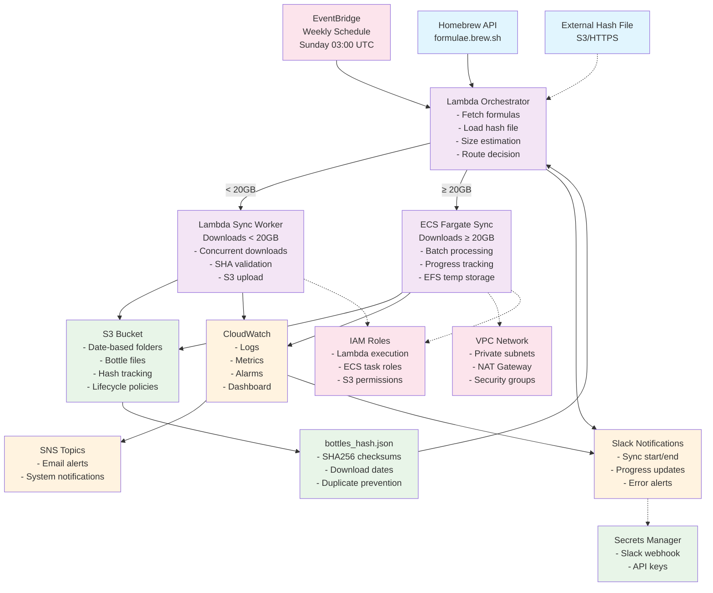

# Homebrew Bottles Sync System

An AWS-based automated solution that downloads and mirrors Homebrew bottles for the three most recent macOS versions on a weekly schedule. The system uses Terraform for infrastructure management, AWS Lambda for orchestration, ECS for large downloads, and S3 for storage.

## Features

- **Automated Weekly Sync**: Runs every Sunday at 03:00 UTC via EventBridge
- **Intelligent Routing**: Uses Lambda for small downloads (<20GB), ECS for large downloads (≥20GB)
- **Duplicate Prevention**: Tracks downloaded bottles via SHA checksums to avoid redundant downloads
- **External Hash File Support**: Load pre-existing bottle hashes from S3 or HTTPS URLs to skip already-downloaded bottles
- **Organized Storage**: Date-based folder structure in S3 for easy management
- **Real-time Notifications**: Slack integration for sync status updates
- **Infrastructure as Code**: Complete Terraform modules for reproducible deployments
- **Cost Optimized**: Lifecycle policies and intelligent routing minimize AWS costs

## Architecture Overview

### High-Level System Flow



### AWS Infrastructure Deployment (Terraform)

```mermaid
graph TB
    %% AWS Account & Region
    AWS[AWS Account<br/>us-east-1]
    
    %% VPC & Networking
    subgraph VPC["🌐 VPC (10.0.0.0/16)"]
        subgraph AZ1["Availability Zone 1a"]
            PUB1[Public Subnet<br/>10.0.1.0/24<br/>NAT Gateway]
            PRIV1[Private Subnet<br/>10.0.10.0/24<br/>ECS Tasks]
        end
        
        subgraph AZ2["Availability Zone 1b"]
            PUB2[Public Subnet<br/>10.0.2.0/24<br/>NAT Gateway]
            PRIV2[Private Subnet<br/>10.0.20.0/24<br/>ECS Tasks]
        end
        
        IGW[Internet Gateway]
        NAT1[NAT Gateway 1]
        NAT2[NAT Gateway 2]
        
        IGW --> PUB1
        IGW --> PUB2
        PUB1 --> NAT1
        PUB2 --> NAT2
        NAT1 --> PRIV1
        NAT2 --> PRIV2
    end
    
    %% Compute Services
    subgraph COMPUTE["💻 Compute Services"]
        subgraph LAMBDA["Lambda Functions"]
            ORCH_L[Orchestrator Function<br/>512MB, 5min timeout<br/>Python 3.11]
            SYNC_L[Sync Worker Function<br/>3GB, 15min timeout<br/>Python 3.11]
            LAYER[Shared Dependencies Layer<br/>boto3, requests, etc.]
        end
        
        subgraph ECS_CLUSTER["ECS Fargate Cluster"]
            CLUSTER[homebrew-sync-cluster<br/>Container Insights Enabled]
            TASK_DEF[Task Definition<br/>2 vCPU, 8GB RAM<br/>100GB Ephemeral Storage]
            SERVICE[ECS Service<br/>Auto Scaling<br/>Fargate + Spot]
        end
    end
    
    %% Storage Services
    subgraph STORAGE["🗄️ Storage Services"]
        S3_MAIN[S3 Main Bucket<br/>homebrew-bottles-prod-{account}<br/>• Versioning Enabled<br/>• Server-Side Encryption<br/>• Lifecycle Policies<br/>• Access Logging]
        
        S3_LOGS[S3 Access Logs Bucket<br/>homebrew-bottles-logs-{account}<br/>• Log Retention<br/>• Cost Optimization]
        
        EFS_FS[EFS File System<br/>• Encrypted at Rest<br/>• General Purpose<br/>• Bursting Throughput<br/>• IA Transition: 30 days]
        
        EFS_AP[EFS Access Point<br/>• POSIX User: 1000:1000<br/>• Root Directory: /homebrew-sync<br/>• Permissions: 755]
    end
    
    %% Security & Access
    subgraph SECURITY["🔐 Security & Access"]
        subgraph IAM_ROLES["IAM Roles"]
            LAMBDA_EXEC[Lambda Execution Role<br/>• CloudWatch Logs<br/>• VPC Access<br/>• Layer Access]
            
            LAMBDA_ORCH[Lambda Orchestrator Role<br/>• S3 Read/Write<br/>• ECS RunTask<br/>• Lambda Invoke<br/>• Secrets Manager]
            
            LAMBDA_SYNC[Lambda Sync Role<br/>• S3 Read/Write<br/>• Secrets Manager<br/>• CloudWatch Metrics]
            
            ECS_EXEC[ECS Task Execution Role<br/>• ECR Pull<br/>• CloudWatch Logs<br/>• Secrets Manager]
            
            ECS_TASK[ECS Task Role<br/>• S3 Read/Write<br/>• EFS Access<br/>• Secrets Manager<br/>• CloudWatch Metrics]
        end
        
        subgraph SECURITY_GROUPS["Security Groups"]
            ECS_SG[ECS Tasks Security Group<br/>• Outbound: 80, 443<br/>• EFS: 2049<br/>• No Inbound]
            
            EFS_SG[EFS Security Group<br/>• Inbound: 2049 from ECS<br/>• Encrypted Transit]
        end
        
        SECRETS[Secrets Manager<br/>• Slack Webhook URL<br/>• Automatic Rotation<br/>• Cross-Region Backup<br/>• KMS Encryption]
    end
    
    %% Monitoring & Logging
    subgraph MONITORING["📊 Monitoring & Logging"]
        subgraph CLOUDWATCH["CloudWatch"]
            CW_LOGS[Log Groups<br/>• /aws/lambda/orchestrator<br/>• /aws/lambda/sync<br/>• /aws/ecs/homebrew-sync<br/>• 14 days retention]
            
            CW_METRICS[Custom Metrics<br/>• Sync Duration<br/>• Bottles Downloaded<br/>• Error Rates<br/>• Cost Tracking]
            
            CW_ALARMS[CloudWatch Alarms<br/>• Lambda Errors<br/>• ECS Task Failures<br/>• High CPU/Memory<br/>• Cost Thresholds]
            
            CW_DASHBOARD[CloudWatch Dashboard<br/>• Real-time Metrics<br/>• Historical Trends<br/>• Cost Analysis]
        end
        
        SNS_TOPIC[SNS Topic<br/>• Email Notifications<br/>• System Alerts<br/>• Cost Notifications<br/>• Security Events]
    end
    
    %% Scheduling & Events
    subgraph EVENTS["⏰ Scheduling & Events"]
        EB_RULE[EventBridge Rule<br/>• Schedule: cron(0 3 ? * SUN *)<br/>• Target: Lambda Orchestrator<br/>• Retry Policy<br/>• DLQ Support]
        
        EB_DLQ[EventBridge DLQ<br/>• Failed Invocations<br/>• Manual Retry<br/>• Alert Integration]
    end
    
    %% External Integrations
    subgraph EXTERNAL["🌍 External Integrations"]
        HOMEBREW[Homebrew API<br/>formulae.brew.sh<br/>• HTTPS Only<br/>• Rate Limiting<br/>• JSON Responses]
        
        SLACK_WH[Slack Webhook<br/>• Rich Notifications<br/>• Error Alerts<br/>• Progress Updates]
        
        EXT_HASH[External Hash Sources<br/>• S3 Cross-Account<br/>• HTTPS URLs<br/>• Validation & Migration]
    end
    
    %% Connections - Networking
    AWS --> VPC
    
    %% Connections - Compute
    ORCH_L -.-> LAYER
    SYNC_L -.-> LAYER
    TASK_DEF --> CLUSTER
    SERVICE --> CLUSTER
    
    %% Connections - Storage
    S3_MAIN --> S3_LOGS
    EFS_FS --> EFS_AP
    EFS_AP --> PRIV1
    EFS_AP --> PRIV2
    
    %% Connections - Security
    LAMBDA_ORCH --> LAMBDA_EXEC
    LAMBDA_SYNC --> LAMBDA_EXEC
    ECS_TASK --> ECS_EXEC
    ECS_SG --> PRIV1
    ECS_SG --> PRIV2
    EFS_SG --> EFS_FS
    
    %% Connections - Monitoring
    CW_ALARMS --> SNS_TOPIC
    CW_METRICS --> CW_DASHBOARD
    
    %% Connections - Events
    EB_RULE --> ORCH_L
    EB_RULE --> EB_DLQ
    
    %% Connections - External
    ORCH_L --> HOMEBREW
    ORCH_L --> EXT_HASH
    SYNC_L --> SLACK_WH
    TASK_DEF --> SLACK_WH
    
    %% Connections - Data Flow
    ORCH_L --> S3_MAIN
    SYNC_L --> S3_MAIN
    TASK_DEF --> S3_MAIN
    TASK_DEF --> EFS_FS
    
    ORCH_L --> SECRETS
    SYNC_L --> SECRETS
    TASK_DEF --> SECRETS
    
    ORCH_L --> CW_LOGS
    SYNC_L --> CW_LOGS
    TASK_DEF --> CW_LOGS
    
    %% Styling
    classDef vpc fill:#e3f2fd
    classDef compute fill:#f3e5f5
    classDef storage fill:#e8f5e8
    classDef security fill:#ffebee
    classDef monitoring fill:#fff3e0
    classDef events fill:#f1f8e9
    classDef external fill:#fce4ec
    
    class VPC,AZ1,AZ2,PUB1,PUB2,PRIV1,PRIV2,IGW,NAT1,NAT2 vpc
    class COMPUTE,LAMBDA,ECS_CLUSTER,ORCH_L,SYNC_L,LAYER,CLUSTER,TASK_DEF,SERVICE compute
    class STORAGE,S3_MAIN,S3_LOGS,EFS_FS,EFS_AP storage
    class SECURITY,IAM_ROLES,SECURITY_GROUPS,LAMBDA_EXEC,LAMBDA_ORCH,LAMBDA_SYNC,ECS_EXEC,ECS_TASK,ECS_SG,EFS_SG,SECRETS security
    class MONITORING,CLOUDWATCH,CW_LOGS,CW_METRICS,CW_ALARMS,CW_DASHBOARD,SNS_TOPIC monitoring
    class EVENTS,EB_RULE,EB_DLQ events
    class EXTERNAL,HOMEBREW,SLACK_WH,EXT_HASH external
```

### Detailed Component Architecture

```
┌─────────────────────────────────────────────────────────────────────────────────┐
│                              HOMEBREW BOTTLES SYNC SYSTEM                       │
├─────────────────────────────────────────────────────────────────────────────────┤
│                                                                                 │
│  ┌─────────────────┐    ┌──────────────────────────────────────────────────┐   │
│  │   SCHEDULING    │    │                 ORCHESTRATION                    │   │
│  │                 │    │                                                  │   │
│  │ ┌─────────────┐ │    │ ┌──────────────────────────────────────────────┐ │   │
│  │ │ EventBridge │ │    │ │           Lambda Orchestrator                │ │   │
│  │ │             │ │    │ │                                              │ │   │
│  │ │ • Weekly    │ │    │ │ 1. Validate configuration                   │ │   │
│  │ │   Schedule  │ │────┼─│ 2. Load existing hash file                  │ │   │
│  │ │ • Manual    │ │    │ │ 3. Fetch formulas from Homebrew API        │ │   │
│  │ │   Triggers  │ │    │ │ 4. Filter new bottles (SHA comparison)     │ │   │
│  │ │ • Retry     │ │    │ │ 5. Estimate download size                   │ │   │
│  │ │   Logic     │ │    │ │ 6. Route to Lambda or ECS                   │ │   │
│  │ └─────────────┘ │    │ │ 7. Send notifications                       │ │   │
│  └─────────────────┘    │ └──────────────────────────────────────────────┘ │   │
│                         └──────────────────────────────────────────────────┘   │
│                                                                                 │
│  ┌─────────────────────────────────────────────────────────────────────────┐   │
│  │                            SYNC WORKERS                                 │   │
│  │                                                                         │   │
│  │ ┌─────────────────────────┐         ┌─────────────────────────────────┐ │   │
│  │ │    Lambda Sync Worker   │         │       ECS Fargate Sync          │ │   │
│  │ │                         │         │                                 │ │   │
│  │ │ • Downloads < 20GB      │         │ • Downloads ≥ 20GB              │ │   │
│  │ │ • 15min timeout         │         │ • Unlimited duration            │ │   │
│  │ │ • 3GB memory max        │         │ • Up to 30GB memory             │ │   │
│  │ │ • Concurrent downloads  │         │ • Batch processing              │ │   │
│  │ │ • SHA256 validation     │         │ • Progress reporting            │ │   │
│  │ │ • Direct S3 upload      │         │ • EFS temp storage              │ │   │
│  │ │ • Error retry           │         │ • Graceful shutdown             │ │   │
│  │ └─────────────────────────┘         │ • Auto-scaling                  │ │   │
│  │                                     └─────────────────────────────────┘ │   │
│  └─────────────────────────────────────────────────────────────────────────┘   │
│                                                                                 │
│  ┌─────────────────────────────────────────────────────────────────────────┐   │
│  │                         STORAGE & STATE                                 │   │
│  │                                                                         │   │
│  │ ┌─────────────────────┐  ┌─────────────────────┐  ┌─────────────────┐  │   │
│  │ │      S3 Bucket      │  │   bottles_hash.json │  │  External Hash  │  │   │
│  │ │                     │  │                     │  │      Sources    │  │   │
│  │ │ • Date folders      │  │ • SHA256 checksums  │  │                 │  │   │
│  │ │   YYYY-MM-DD/       │  │ • Download dates    │  │ • S3 locations  │  │   │
│  │ │ • Bottle files      │  │ • File sizes        │  │ • HTTPS URLs    │  │   │
│  │ │   .bottle.tar.gz    │  │ • Last updated      │  │ • Migration     │  │   │
│  │ │ • Versioning        │  │ • Atomic updates    │  │ • Validation    │  │   │
│  │ │ • Lifecycle rules   │  │ • Corruption detect │  │ • Fallback      │  │   │
│  │ │ • Encryption        │  │ • Backup/restore    │  │                 │  │   │
│  │ └─────────────────────┘  └─────────────────────┘  └─────────────────┘  │   │
│  └─────────────────────────────────────────────────────────────────────────┘   │
│                                                                                 │
│  ┌─────────────────────────────────────────────────────────────────────────┐   │
│  │                      MONITORING & NOTIFICATIONS                         │   │
│  │                                                                         │   │
│  │ ┌─────────────────┐ ┌─────────────────┐ ┌─────────────────────────────┐ │   │
│  │ │   CloudWatch    │ │ Slack Webhooks  │ │         SNS Topics          │ │   │
│  │ │                 │ │                 │ │                             │ │   │
│  │ │ • Logs          │ │ • Sync start    │ │ • Email notifications       │ │   │
│  │ │ • Metrics       │ │ • Progress      │ │ • System alerts             │ │   │
│  │ │ • Alarms        │ │ • Success/fail  │ │ • Cost thresholds           │ │   │
│  │ │ • Dashboard     │ │ • Error details │ │ • Security events           │ │   │
│  │ │ • Insights      │ │ • Rich format   │ │ • Integration hooks         │ │   │
│  │ └─────────────────┘ └─────────────────┘ └─────────────────────────────┘ │   │
│  └─────────────────────────────────────────────────────────────────────────┘   │
│                                                                                 │
│  ┌─────────────────────────────────────────────────────────────────────────┐   │
│  │                         INFRASTRUCTURE                                  │   │
│  │                                                                         │   │
│  │ ┌─────────────┐ ┌─────────────┐ ┌─────────────┐ ┌─────────────────────┐ │   │
│  │ │     VPC     │ │ IAM Roles   │ │   Secrets   │ │    EFS Storage      │ │   │
│  │ │             │ │             │ │   Manager   │ │                     │ │   │
│  │ │ • Private   │ │ • Lambda    │ │             │ │ • Temp files        │ │   │
│  │ │   subnets   │ │   execution │ │ • Slack     │ │ • ECS mount         │ │   │
│  │ │ • NAT GW    │ │ • ECS task  │ │   webhook   │ │ • Auto cleanup      │ │   │
│  │ │ • Security  │ │ • S3 access │ │ • API keys  │ │ • Encryption        │ │   │
│  │ │   groups    │ │ • Least     │ │ • Rotation  │ │ • Performance       │ │   │
│  │ │ • NACLs     │ │   privilege │ │ • Backup    │ │   modes             │ │   │
│  │ └─────────────┘ └─────────────┘ └─────────────┘ └─────────────────────┘ │   │
│  └─────────────────────────────────────────────────────────────────────────┘   │
└─────────────────────────────────────────────────────────────────────────────────┘
```

### Data Flow Sequence

```
1. TRIGGER (Weekly/Manual)
   EventBridge → Lambda Orchestrator
   
2. INITIALIZATION
   Orchestrator → Load Configuration
   Orchestrator → Load Hash File (S3/External)
   Orchestrator → Fetch Formulas (Homebrew API)
   
3. PLANNING
   Orchestrator → Filter New Bottles (SHA comparison)
   Orchestrator → Estimate Download Size
   Orchestrator → Send Start Notification (Slack)
   
4. ROUTING DECISION
   IF size < 20GB:
     Orchestrator → Lambda Sync Worker
   ELSE:
     Orchestrator → ECS Fargate Task
   
5. DOWNLOAD EXECUTION
   Sync Worker → Download Bottles (Parallel)
   Sync Worker → Validate SHA256
   Sync Worker → Upload to S3 (Date folder)
   Sync Worker → Update Hash File
   
6. COMPLETION
   Sync Worker → Send Success/Failure (Slack)
   CloudWatch → Log Metrics
   S3 → Apply Lifecycle Policies
```

### Target Platforms

The system synchronizes bottles for the three most recent macOS versions:

- **`arm64_sonoma`** - macOS Sonoma (14.x) on Apple Silicon
- **`arm64_ventura`** - macOS Ventura (13.x) on Apple Silicon  
- **`monterey`** - macOS Monterey (12.x) on Intel/Apple Silicon

### Key Design Principles

1. **Intelligent Routing**: Automatic selection between Lambda and ECS based on workload size
2. **Duplicate Prevention**: SHA256-based tracking prevents redundant downloads
3. **Fault Tolerance**: Retry logic, graceful degradation, and error recovery
4. **Cost Optimization**: Lifecycle policies, spot instances, and efficient resource allocation
5. **Observability**: Comprehensive logging, metrics, and real-time notifications
6. **Security**: Least privilege IAM, encrypted storage, and secure communications
7. **Scalability**: Auto-scaling ECS tasks and concurrent Lambda executions

## Quick Start

### Prerequisites

- AWS CLI configured with appropriate permissions
- Terraform >= 1.0
- Python 3.9+ (for local testing)
- Slack webhook URL (optional, for notifications)

### 1. Clone and Configure

```bash
git clone <repository-url>
cd homebrew-bottles-sync
cp terraform/terraform.tfvars.example terraform/terraform.tfvars
```

### 2. Configure Variables

Edit `terraform/terraform.tfvars`:

```hcl
# Required
aws_region = "us-west-2"
environment = "prod"
s3_bucket_name = "my-homebrew-bottle-mirror"

# Optional
slack_webhook_url = "https://hooks.slack.com/services/YOUR/WEBHOOK/URL"
size_threshold_gb = 20
enable_notifications = true
```

### 3. Deploy Infrastructure

```bash
cd terraform
terraform init
terraform plan
terraform apply
```

### 4. Verify Deployment

The system will automatically start syncing on the next scheduled run (Sunday 03:00 UTC). To trigger a manual sync:

```bash
aws events put-events --entries file://manual-trigger.json
```

## Configuration

### Environment Variables

The system uses the following configuration options:

| Variable | Description | Default | Required |
|----------|-------------|---------|----------|
| `aws_region` | AWS region for deployment | `us-west-2` | Yes |
| `environment` | Environment name (dev/staging/prod) | `prod` | Yes |
| `s3_bucket_name` | S3 bucket for bottle storage | - | Yes |
| `slack_webhook_url` | Slack webhook for notifications | - | No |
| `size_threshold_gb` | Threshold for Lambda vs ECS routing | `20` | No |
| `enable_notifications` | Enable Slack notifications | `true` | No |
| `schedule_expression` | EventBridge cron expression | `cron(0 3 ? * SUN *)` | No |
| `external_hash_file_s3_key` | S3 key for external hash file | - | No |
| `external_hash_file_s3_bucket` | S3 bucket for external hash file | - | No |
| `external_hash_file_url` | HTTPS URL for external hash file | - | No |

### External Hash File Support

The system can load pre-existing bottle hashes from external sources to skip already-downloaded bottles. This is useful for:

- Initial deployment with existing bottle collections
- Migration from other sync systems
- Disaster recovery scenarios

See [EXTERNAL_HASH_FILE.md](EXTERNAL_HASH_FILE.md) for detailed configuration and usage instructions.

### Terraform Infrastructure Modules

The infrastructure is deployed using 8 modular Terraform components that create all AWS resources:

#### 🌐 **Network Module** (`terraform/modules/network/`)
```hcl
# Creates VPC with public/private subnets across 2 AZs
module "network" {
  source = "./modules/network"
  
  vpc_cidr             = "10.0.0.0/16"
  availability_zones   = ["us-east-1a", "us-east-1b"]
  public_subnet_cidrs  = ["10.0.1.0/24", "10.0.2.0/24"]
  private_subnet_cidrs = ["10.0.10.0/24", "10.0.20.0/24"]
  enable_nat_gateway   = true
}
```
**Resources Created:**
- VPC with DNS hostnames enabled
- Internet Gateway for public access
- 2 Public subnets with NAT Gateways
- 2 Private subnets for ECS tasks
- Route tables and associations
- Security groups for ECS and EFS

#### 🗄️ **S3 Module** (`terraform/modules/s3/`)
```hcl
# Creates S3 bucket with versioning and lifecycle policies
module "s3" {
  source = "./modules/s3"
  
  bucket_name                        = "homebrew-bottles-prod-123456789"
  enable_versioning                  = true
  lifecycle_expiration_days          = 90
  noncurrent_version_expiration_days = 30
}
```
**Resources Created:**
- Main S3 bucket with server-side encryption
- S3 bucket versioning configuration
- Lifecycle policies for cost optimization
- Access logging bucket (optional)
- Bucket policies for Lambda/ECS access
- Public access block settings

#### ⚡ **Lambda Module** (`terraform/modules/lambda/`)
```hcl
# Creates Lambda functions with shared layer
module "lambda" {
  source = "./modules/lambda"
  
  orchestrator_timeout     = 300  # 5 minutes
  orchestrator_memory_size = 512  # MB
  sync_timeout            = 900   # 15 minutes
  sync_memory_size        = 3008  # MB (max)
}
```
**Resources Created:**
- Lambda layer with shared dependencies (boto3, requests)
- Orchestrator Lambda function with EventBridge trigger
- Sync worker Lambda function for small downloads
- CloudWatch log groups with retention policies
- Lambda permissions for cross-service invocation
- Dead Letter Queues (optional)

#### 🐳 **ECS Module** (`terraform/modules/ecs/`)
```hcl
# Creates ECS cluster with Fargate tasks
module "ecs" {
  source = "./modules/ecs"
  
  task_cpu                   = 2048  # 2 vCPU
  task_memory               = 8192  # 8 GB
  ephemeral_storage_size_gb = 100   # Temp storage
  enable_efs                = true  # Shared storage
}
```
**Resources Created:**
- ECS Fargate cluster with Container Insights
- Task definition with resource limits
- EFS file system for temporary storage
- EFS access points with POSIX permissions
- EFS mount targets in private subnets
- Security groups for ECS-EFS communication
- CloudWatch alarms for CPU/memory

#### 🔐 **IAM Module** (`terraform/modules/iam/`)
```hcl
# Creates IAM roles with least privilege
module "iam" {
  source = "./modules/iam"
  
  s3_bucket_arn            = module.s3.bucket_arn
  slack_webhook_secret_arn = module.notifications.secret_arn
}
```
**Resources Created:**
- Lambda execution roles (basic + VPC access)
- Lambda orchestrator role (S3, ECS, Lambda invoke)
- Lambda sync worker role (S3, Secrets Manager)
- ECS task execution role (ECR, CloudWatch, Secrets)
- ECS task role (S3, EFS, application permissions)
- IAM policies with specific resource ARNs
- Cross-service assume role policies

#### 📅 **EventBridge Module** (`terraform/modules/eventbridge/`)
```hcl
# Creates scheduled triggers
module "eventbridge" {
  source = "./modules/eventbridge"
  
  schedule_expression = "cron(0 3 ? * SUN *)"  # Weekly Sunday 3 AM
  rule_state         = "ENABLED"
}
```
**Resources Created:**
- EventBridge rule with cron schedule
- Lambda target configuration
- Retry policy with exponential backoff
- Dead letter queue for failed invocations
- CloudWatch alarms for missed schedules
- IAM permissions for EventBridge → Lambda

#### 💬 **Notifications Module** (`terraform/modules/notifications/`)
```hcl
# Creates Slack integration and SNS
module "notifications" {
  source = "./modules/notifications"
  
  slack_webhook_url           = var.slack_webhook_url
  enable_sns_notifications    = true
  notification_email_addresses = ["admin@company.com"]
}
```
**Resources Created:**
- Secrets Manager secret for Slack webhook
- SNS topic for system notifications
- SNS subscriptions (email, SMS)
- KMS key for secret encryption (optional)
- Cross-region secret replication (optional)
- Secret rotation Lambda (optional)

#### 📊 **Monitoring Module** (`terraform/modules/monitoring/`)
```hcl
# Creates CloudWatch dashboards and alarms
module "monitoring" {
  source = "./modules/monitoring"
  
  enable_cloudwatch_alarms = true
  alert_email             = "alerts@company.com"
}
```
**Resources Created:**
- CloudWatch dashboard with custom widgets
- CloudWatch alarms for Lambda errors
- CloudWatch alarms for ECS task failures
- Custom metrics for sync statistics
- Log insights queries for troubleshooting
- Cost anomaly detection (optional)
- X-Ray tracing configuration (optional)

### Module Dependencies

```
network ──┐
          ├─→ ecs ──┐
s3 ───────┤        ├─→ main.tf (orchestration)
          ├─→ lambda┤
iam ──────┤        │
          ├─→ eventbridge
notifications ────┤
                  └─→ monitoring
```

Each module is self-contained with its own `variables.tf`, `main.tf`, and `outputs.tf` files, making the infrastructure modular and reusable across environments.

## Usage

### Manual Sync Trigger

To manually trigger a sync outside the scheduled time:

```bash
# Using AWS CLI
aws lambda invoke \
  --function-name homebrew-sync-orchestrator \
  --payload '{"source": "manual"}' \
  response.json

# Using EventBridge
aws events put-events \
  --entries Source=homebrew.sync,DetailType="Manual Sync",Detail='{}'
```

### Monitoring Sync Progress

Check CloudWatch logs for detailed sync progress:

```bash
# Orchestrator logs
aws logs tail /aws/lambda/homebrew-sync-orchestrator --follow

# ECS task logs (when applicable)
aws logs tail /aws/ecs/homebrew-sync --follow
```

### Accessing Downloaded Bottles

Bottles are stored in S3 with the following structure:

```
s3://your-bucket-name/
├── bottles_hash.json                    # Global hash tracking file
├── 2025-07-21/                         # Weekly sync folders
│   ├── curl-8.0.0.arm64_sonoma.bottle.tar.gz
│   ├── curl-8.0.0.arm64_ventura.bottle.tar.gz
│   ├── curl-8.0.0.monterey.bottle.tar.gz
│   └── ...
├── 2025-07-28/
│   └── ...
└── 2025-08-04/
    └── ...
```

Download bottles using AWS CLI:

```bash
# List available dates
aws s3 ls s3://your-bucket-name/ --recursive

# Download specific bottle
aws s3 cp s3://your-bucket-name/2025-07-21/curl-8.0.0.arm64_sonoma.bottle.tar.gz ./

# Sync entire date folder
aws s3 sync s3://your-bucket-name/2025-07-21/ ./bottles/
```

## Slack Notifications

The system sends notifications at key points during the sync process:

### Sync Start Notification
```
🚀 Homebrew Bottles Sync Started
Environment: prod
Date: 2025-07-21
Estimated bottles: 1,247
Estimated size: 15.3 GB
Sync method: Lambda
```

### Progress Updates (ECS only)
```
⏳ Homebrew Sync Progress
Downloaded: 45/150 bottles (30%)
Size: 2.3 GB / 7.8 GB
ETA: 12 minutes
```

### Success Notification
```
✅ Homebrew Bottles Sync Complete
Environment: prod
Date: 2025-07-21
New bottles: 143
Total size: 512 MB
Duration: 8 minutes
S3 location: s3://homebrew-bottles/2025-07-21/
```

### Failure Notification
```
❌ Homebrew Bottles Sync Failed
Environment: prod
Date: 2025-07-21
Error: Timeout downloading curl-8.0.0.arm64_sonoma.bottle.tar.gz
Duration: 14 minutes
Check logs: /aws/lambda/homebrew-sync-orchestrator
```

## Troubleshooting

### Common Issues

#### 1. Lambda Timeout Errors

**Symptom**: Lambda function times out during sync
```
Task timed out after 900.00 seconds
```

**Solution**: 
- Check if download size exceeds Lambda threshold (20GB)
- Verify ECS cluster is properly configured
- Increase Lambda timeout in Terraform configuration

```hcl
# In terraform/modules/lambda/main.tf
resource "aws_lambda_function" "orchestrator" {
  timeout = 900  # Increase if needed
}
```

#### 2. S3 Permission Errors

**Symptom**: Access denied when uploading to S3
```
An error occurred (AccessDenied) when calling the PutObject operation
```

**Solution**:
- Verify IAM roles have S3 permissions
- Check S3 bucket policy allows Lambda/ECS access
- Ensure bucket exists and is in correct region

```bash
# Check IAM role permissions
aws iam get-role-policy --role-name homebrew-sync-lambda-role --policy-name S3Access

# Verify bucket exists
aws s3 ls s3://your-bucket-name/
```

#### 3. ECS Task Failures

**Symptom**: ECS tasks fail to start or complete
```
Task stopped with exit code 1
```

**Solution**:
- Check ECS task logs in CloudWatch
- Verify ECS cluster has sufficient capacity
- Ensure task definition has correct IAM role

```bash
# Check ECS cluster status
aws ecs describe-clusters --clusters homebrew-sync

# View task logs
aws logs tail /aws/ecs/homebrew-sync --follow
```

#### 4. Hash File Corruption

**Symptom**: Sync fails with hash file validation errors
```
Invalid hash file format: bottles_hash.json
```

**Solution**:
- Delete corrupted hash file to trigger rebuild
- Check S3 versioning to restore previous version

```bash
# Delete corrupted hash file
aws s3 rm s3://your-bucket-name/bottles_hash.json

# Restore from version (if versioning enabled)
aws s3api list-object-versions --bucket your-bucket-name --prefix bottles_hash.json
aws s3api get-object --bucket your-bucket-name --key bottles_hash.json --version-id VERSION_ID bottles_hash.json
```

#### 5. Slack Notification Failures

**Symptom**: No Slack notifications received
```
Failed to send Slack notification: 404 Not Found
```

**Solution**:
- Verify Slack webhook URL is correct
- Check Secrets Manager contains valid webhook
- Test webhook manually

```bash
# Check secret value
aws secretsmanager get-secret-value --secret-id homebrew-sync/slack-webhook

# Test webhook manually
curl -X POST -H 'Content-type: application/json' \
  --data '{"text":"Test notification"}' \
  YOUR_WEBHOOK_URL
```

### Debugging Steps

1. **Check CloudWatch Logs**
   ```bash
   # Lambda orchestrator
   aws logs tail /aws/lambda/homebrew-sync-orchestrator --follow
   
   # Lambda sync worker
   aws logs tail /aws/lambda/homebrew-sync-worker --follow
   
   # ECS tasks
   aws logs tail /aws/ecs/homebrew-sync --follow
   ```

2. **Verify Infrastructure State**
   ```bash
   cd terraform
   terraform plan  # Check for configuration drift
   terraform show  # View current state
   ```

3. **Check AWS Resources**
   ```bash
   # EventBridge rules
   aws events list-rules --name-prefix homebrew-sync
   
   # Lambda functions
   aws lambda list-functions --function-version ALL
   
   # ECS clusters
   aws ecs list-clusters
   aws ecs describe-clusters --clusters homebrew-sync
   ```

4. **Monitor Metrics**
   - CloudWatch dashboard: `homebrew-sync-dashboard`
   - Key metrics: sync duration, error rate, bottle count
   - Alarms: sync failures, cost thresholds

### Performance Optimization

#### Reduce Sync Time
- Increase ECS task CPU/memory allocation
- Enable parallel downloads in sync workers
- Use S3 Transfer Acceleration

#### Reduce Costs
- Adjust S3 lifecycle policies
- Use Spot instances for ECS (if acceptable)
- Optimize Lambda memory allocation

#### Improve Reliability
- Enable S3 Cross-Region Replication
- Implement retry logic with exponential backoff
- Set up CloudWatch alarms for proactive monitoring

## Development

### Local Testing

```bash
# Install dependencies
pip install -r requirements.txt
pip install -r lambda/orchestrator/requirements.txt
pip install -r lambda/sync/requirements.txt

# Run unit tests
python -m pytest tests/ -v

# Run integration tests (requires AWS credentials)
python -m pytest tests/test_integration.py -v
```

### Adding New Features

1. Update requirements in `.kiro/specs/homebrew-bottles-sync/requirements.md`
2. Modify design in `.kiro/specs/homebrew-bottles-sync/design.md`
3. Add implementation tasks to `.kiro/specs/homebrew-bottles-sync/tasks.md`
4. Implement changes following the existing patterns
5. Add tests for new functionality
6. Update documentation

## Security Considerations

- All IAM roles follow least privilege principle
- Secrets stored in AWS Secrets Manager
- S3 bucket has server-side encryption enabled
- ECS tasks run in private subnets
- CloudTrail logging enabled for audit trail

## Cost Estimation

Typical monthly costs for moderate usage:

- Lambda: $5-15 (orchestrator + sync functions)
- ECS: $10-30 (Fargate tasks for large syncs)
- S3: $20-100 (storage + requests, varies by bottle count)
- EventBridge: <$1 (scheduled rules)
- CloudWatch: $5-15 (logs + metrics)

**Total: $40-160/month** (varies significantly based on bottle storage)

## Support

For issues and questions:

1. Check this troubleshooting guide
2. Review CloudWatch logs for error details
3. Consult Terraform module documentation
4. Open an issue in the project repository

## License

[Add your license information here]